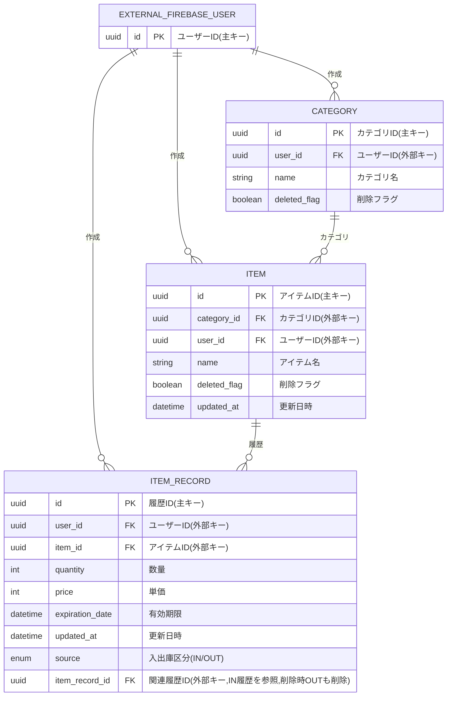

## ER図



## DBML
```
Table EXTERNAL_FIREBASE_USER {
  id uuid [pk]
}

Table category {
  id uuid [pk]
  user_id uuid [ref: > EXTERNAL_FIREBASE_USER.id,not null]
  name string [note: 'カテゴリ名', not null]
  deleted_flag boolean [note: '削除フラグ', default: false]
}

Table item {
  id uuid [pk]
  category_id uuid [ref: > category.id,not null]
  user_id uuid [ref: > EXTERNAL_FIREBASE_USER.id, not null]
  name string [note: 'アイテム名', not null]
  deleted_flag boolean [note: '削除フラグ', default: false]
  updated_at datetime [note: '更新日時', default: `current_timestamp`]
}

Table item_record {
  id uuid [pk]
  user_id uuid [ref: > EXTERNAL_FIREBASE_USER.id, not null]
  item_id uuid [ref: > item.id, not null]
  quantity int [note: '数量', default: 0]
  price int [note: '単価', default: 0]
  expiration_date datetime [note: '有効期限', default: null]
  updated_at datetime [note:"更新日時",default: `current_timestamp`]
  source enum('IN', 'OUT') [note: '入出庫区分', not null]
  item_record_id uuid [ref: > item_record.id, note: '関連履歴ID', default: null]
}
```
