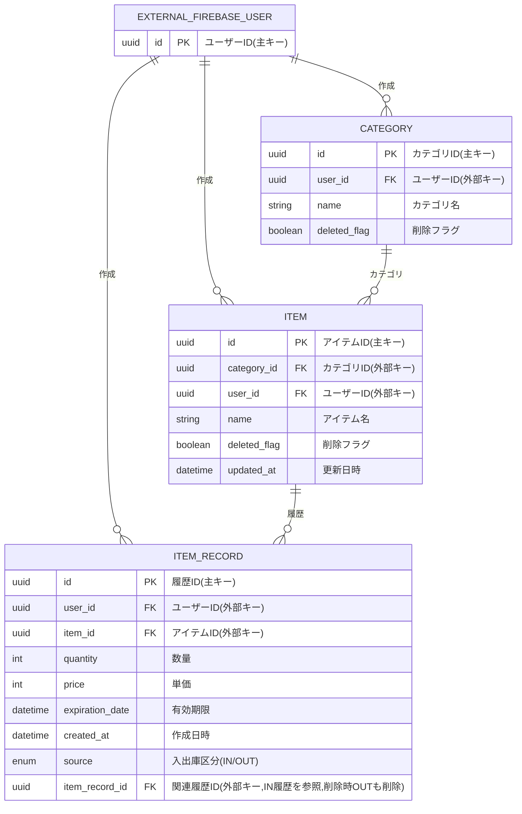

# 要件定義書（フェーズ1）

## 1. はじめに
- **プロジェクト名：** 在庫管理アプリ
- **作成日：** 2025-09-11

## 2. 目的
現状のアイテム属性が不足しているため、アイテムの属性を追加することで、在庫管理アプリの利便性を向上させることを目的とします。

## 3. 機能要件
アイテムごとに複数の記録用テーブル（入庫・出庫など）を追加し、アイテムの管理が柔軟に作成できるようにします。

現状の問題点：
- アイテムの詳細属性が不足している。
  - 現状のアイテム属性
    - 名前
    - 数量
    - カテゴリ
    - 更新日時
- アイテムの入庫・出庫の履歴が管理できない。
- アイテムのカテゴリを変更できない。
- 各アイテムの有効期限や価格を管理できない。

### 3.1 要件1
- **説明：**  アイテムはカテゴリ更新できるようにする。
- **理由：**  アイテムの分類を変更する場合があるため。
- **仕様**  
  - アイテムのカテゴリはデフォルト含めてユーザが所有するカテゴリに変更可能、カテゴリがない場合はエラーとする。

### 3.2 要件2
- **説明：**  アイテムの作成・更新API（POST: api/items , PUT: api/items）は、数量の設定はなしにする。
- **理由：**  数量はアイテム入出庫用テーブルで管理するため。
- **仕様**  
  - リクエストボディから数量フィールドを削除する。
  
### 3.3 要件3
- **説明：**  アイテムの入出庫用テーブルを追加する。
- **理由：**  アイテムの詳細を管理するため。
- **仕様**  
  - アイテム入出庫用テーブルを新規作成し、以下の属性を持つ。
    - ID（UUID、主キー、必須）
    - アイテムID（外部キー、必須）
    - 数量（整数、必須）
    - 有効期限（日時、任意）
    - 単価（整数、必須）
    - 作成日時（日時、必須）
    - 各属性の制約は以下の通りとする。
      - アイテムID：存在するアイテムのIDであること。
      - 数量：0以上の整数。
      - 単価：0以上の整数。
      - 有効期限：YYYY-MM-DD形式日時（任意）、Nullも可。

### 3.4 要件4
- **説明：**  アイテムの一覧を取得するAPIは、各アイテムの数量と価格の合計を含める。
- **理由：**  在庫の総価値を把握しやすくするため。
- **仕様**  
  - エンドポイント：`GET /api/items?category_name=category_name`
  - クエリパラメータ：カテゴリ名
  - 説明：ユーザーが所有する全てのアイテムのリストを取得する。
  - レスポンス: 各アイテムのID、名前、カテゴリ名、削除フラグ、更新日時、数量の合計、価格の合計を含むJSON形式で返す。
    例：
     ```json
     [
        {
          "id": "uuid",
          "name": "item name",
          "categoryName": "category name",
          "quantity": 100,
          "total_price": 5000
        },
         ...
       ]
     ```
  - 数量と価格の合計は、アイテムの入出庫用テーブルから集計する。

### 3.5 要件5
- **説明：**  アイテムの入出庫用テーブルに対するCRUD操作を提供するAPIを実装する。
- **理由：**  アイテムの在庫管理するため。
- **仕様**  
  - **アイテム履歴作成**
    - エンドポイント：`POST /api/item/records`
    - リクエストボディ：JSON形式で、アイテムID、数量、単価、有効期限（任意）を含む。
      - 例： 入庫
      ```json
      {
        "item_id": "uuid",
        "quantity": 10,
        "price": 1000,
        "source": "IN",
        "expiration_date": "2024-12-31",
      }
      ```
      - 例： 出庫
      ```json
      {
        "item_id": "uuid",
        "quantity": 10,
        "source": "OUT",
        "item_record_id": "uuid"
      }
      ```
    - レスポンス:
      - 入庫成功のメッセージをJSON形式で返す。例：
        ```json
        {
          "message":"アイテム入庫しました。"
        }
        ```
      - 出庫成功のメッセージをJSON形式で返す。例：
        ```json
        {
          "message":"アイテム出庫しました。"
        }
        ```
    - バリデーション：必須フィールドのチェック、データ型のチェック、制約のチェック、出庫時に在庫数量のチェック。
    - エラーハンドリング：バリデーションエラー時は400エラーを返す。
  - **履歴リストを取得**
    - エンドポイント：`GET /api/item/records`
    - レスポンス：ユーザの入出庫履歴のリストをJSON形式で返す。
      - response例：
      ```json
      [
        {
          "record_id": "uuid",
          "item_name": "name",
          "category_name": "category",
          "quantity": 10,
          "unit_price": 1000,
          "source": "IN",
          "expiration_date": "2024-12-31",
        },
        ...
      ]
      ```
  - **単体の履歴を取得**
    - エンドポイント：`GET /api/item/records?record_id={record_id}`
    - 説明：指定された履歴IDに関連するアイテムの詳細情報を取得する。
    - クエリパラメータ：履歴ID
    - レスポンス：指定された履歴IDにアイテム詳細の情報をJSON形式で返す。
      - response例：
      ```json
      {
        "item_name": "name",
        "category_name": "category",
        "quantity": 10,
        "unit_price": 1000,
        "source": "IN",
        "expiration_date": "2024-12-31",
      }
      ```
  - **単体で履歴を削除**
    - エンドポイント：`DELETE /api/item/records?record_id={record_id}`
    - クエリパラメータ：履歴ID
    - レスポンス：
      - 削除成功のメッセージをJSON形式で返す。
      - 物理削除とする。
    - エラーハンドリング：アイテム履歴IDが存在しない場合は404エラーを返す。
  - **指定のアイテムの全履歴を取得**
    - エンドポイント：`GET /api/items/{item_id}/records`
    - パスパラメータ：アイテムID
    - レスポンス：指定されたアイテムIDに関連する全ての履歴の情報をJSON形式で返す。
      - response例：
        ```json
        [
            {
              "record_id": "uuid",
              "quantity": 10,
              "price": 1000,
              "source": "IN",
              "expiration_date": "2024-12-31",
            },
            {
              "record_id": "uuid",
              "quantity": 5,
              "source": "OUT",
              "item_record_id": "uuid"
            }
          ]
        ```
    - エラーハンドリング：アイテムIDが存在しない場合は404エラーを返す。
  
## 4. 非機能要件
### 4.1 セキュリティ
ユーザー認証（Firebase認証）を必須とし、認証されていないユーザーはデータ操作不可とする。

### 4.2 信頼性
データの整合性を保つため、更新・削除時はトランザクション管理を行うこと。

### 4.3 テスト
機能追加や変更に対して、単体テストを実施し、品質を担保すること。

## 5. データベース設計

