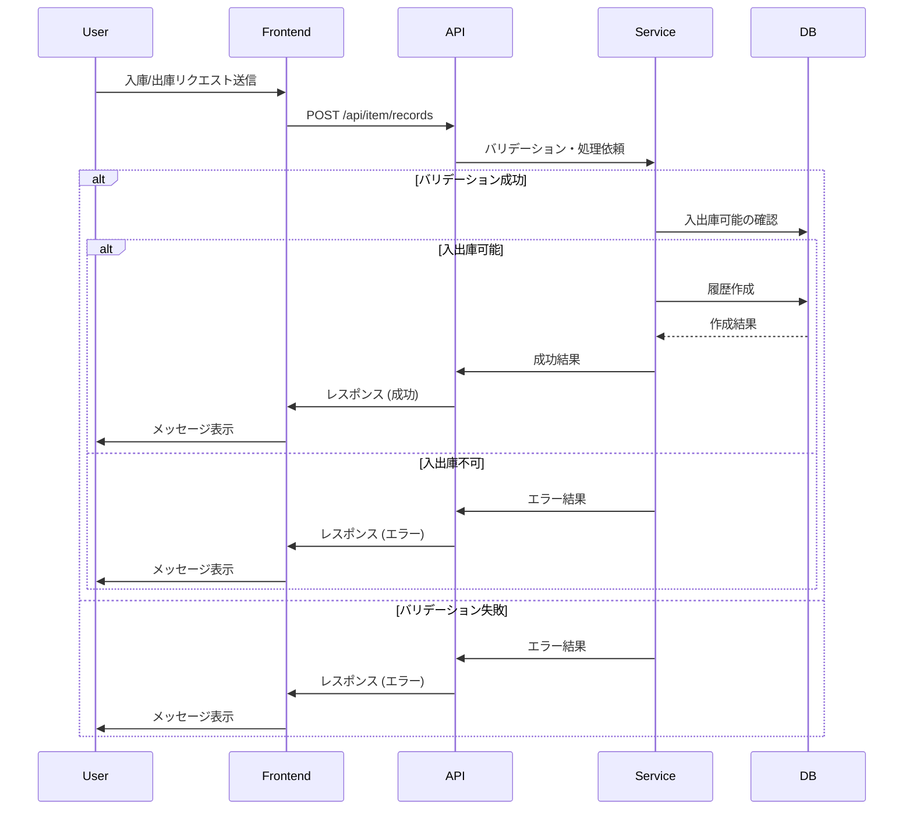
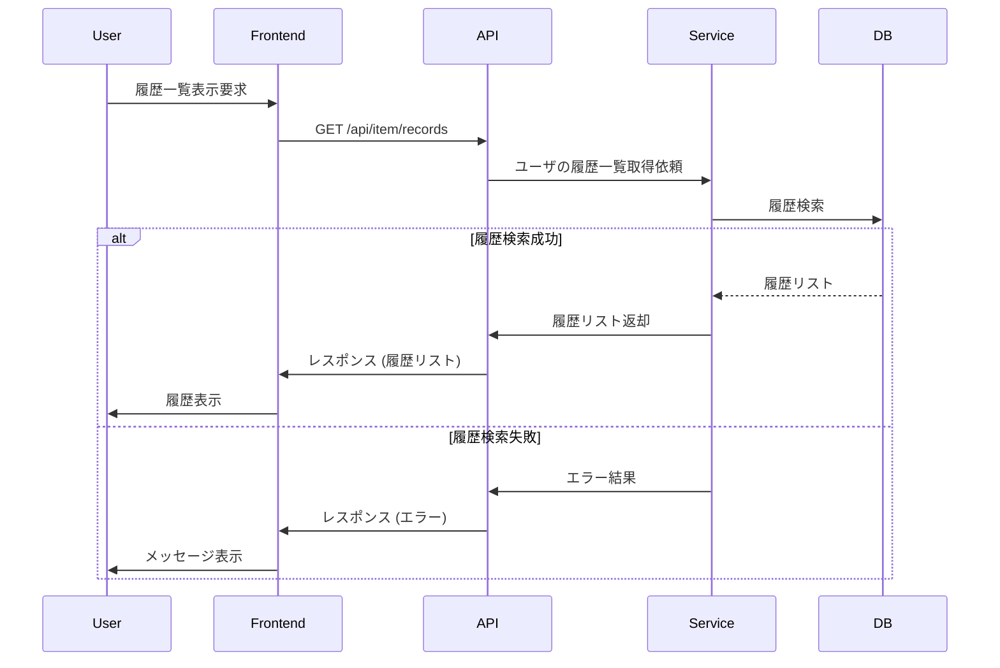
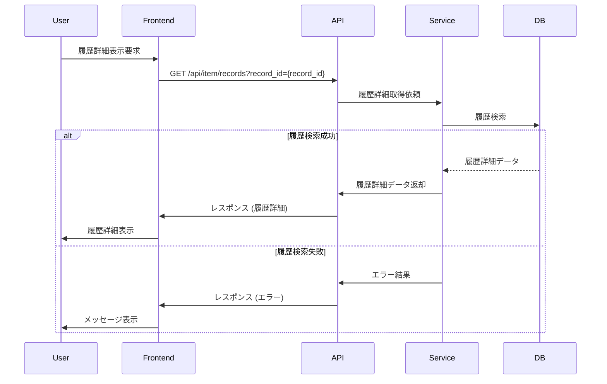
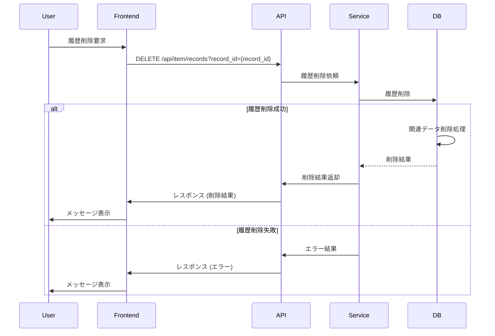
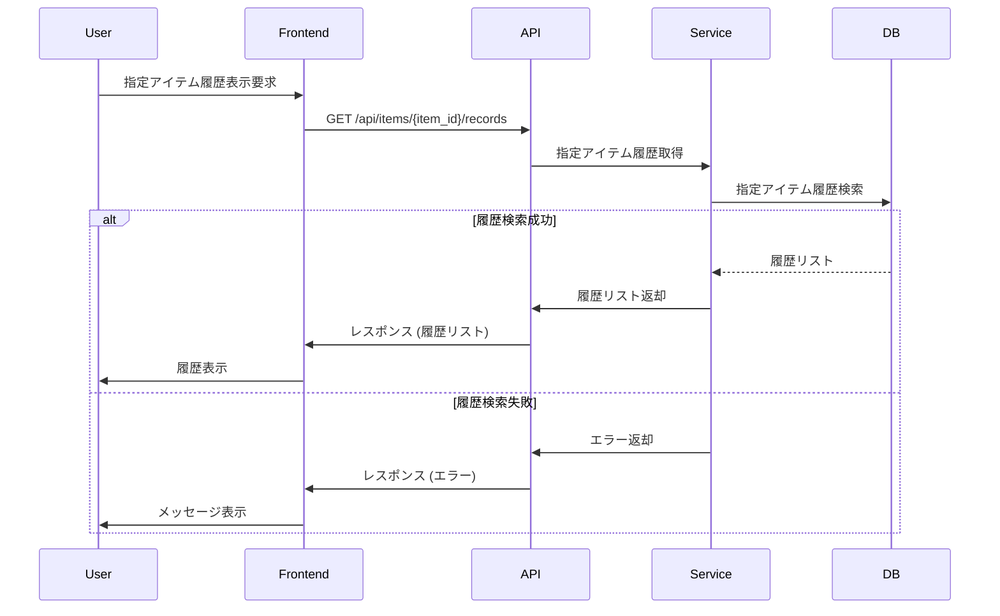
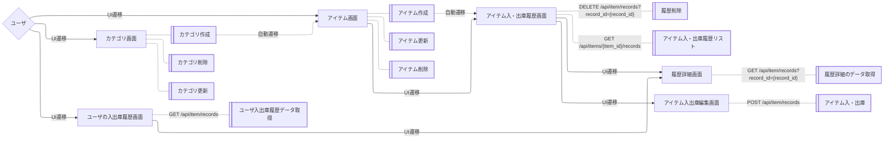

## アイテム入出庫履歴 API シーケンス図

### 履歴作成


### ユーザの履歴リスト取得


### 履歴詳細取得


### 履歴削除


### 指定のアイテムの入出庫履歴取得


### 画面遷移図



### 入庫履歴フローチャート

  ```mermaid
  ---
  config:
    theme: neutral
  ---
  flowchart TD
          in(("入庫操作"))
          record[("履歴テーブル")]
          item[("アイテムテーブル")]
          in -- 入庫履歴追加 --> record
          record -- 履歴変更に基づき再計算 --> item
  ```

### 出庫履歴フローチャート

  ```mermaid
  ---
  config:
    theme: neutral
  ---
  flowchart TD
          out(("出庫操作"))
          record[("履歴テーブル")]
          item[("アイテムテーブル")]
          out -- 出庫履歴追加 --> record
          record -- 履歴変更に基づき再計算 --> item
  ```

### 操作取消フローチャート

  ```mermaid
  ---
  config:
    theme: neutral
  ---
  flowchart TD
          cancel(("入出庫操作取り消し"))
          record[("履歴テーブル")]
          item[("アイテムテーブル")]
          cancel -- 履歴削除 --> record
          record -- 履歴変更に基づき再計算 --> item
  ```
