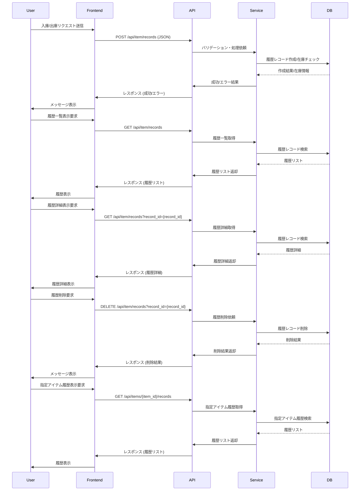
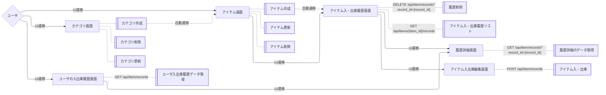

## アイテム入出庫履歴 CRUD API シーケンス図

```mermaid
sequenceDiagram
    participant User
    participant Frontend
    participant API
    participant Service
    participant DB

    %% アイテム履歴作成（入庫/出庫）
    User->>Frontend: 入庫/出庫リクエスト送信
    Frontend->>API: POST /api/item/records (JSON)
    API->>Service: バリデーション・処理依頼
    Service->>DB: 履歴レコード作成/在庫チェック
    DB-->>Service: 作成結果/在庫情報
    Service->>API: 成功/エラー結果
    API->>Frontend: レスポンス (成功/エラー)
    Frontend->>User: メッセージ表示

    %% 履歴リスト取得
    User->>Frontend: 履歴一覧表示要求
    Frontend->>API: GET /api/item/records
    API->>Service: 履歴一覧取得
    Service->>DB: 履歴レコード検索
    DB-->>Service: 履歴リスト
    Service->>API: 履歴リスト返却
    API->>Frontend: レスポンス (履歴リスト)
    Frontend->>User: 履歴表示

    %% 単体履歴取得
    User->>Frontend: 履歴詳細表示要求
    Frontend->>API: GET /api/item/records?record_id={record_id}
    API->>Service: 履歴詳細取得
    Service->>DB: 履歴レコード検索
    DB-->>Service: 履歴詳細
    Service->>API: 履歴詳細返却
    API->>Frontend: レスポンス (履歴詳細)
    Frontend->>User: 履歴詳細表示

    %% 履歴削除
    User->>Frontend: 履歴削除要求
    Frontend->>API: DELETE /api/item/records?record_id={record_id}
    API->>Service: 履歴削除依頼
    Service->>DB: 履歴レコード削除
    DB-->>Service: 削除結果
    Service->>API: 削除結果返却
    API->>Frontend: レスポンス (削除結果)
    Frontend->>User: メッセージ表示

    %% 指定アイテムの全履歴取得
    User->>Frontend: 指定アイテム履歴表示要求
    Frontend->>API: GET /api/items/{item_id}/records
    API->>Service: 指定アイテム履歴取得
    Service->>DB: 指定アイテム履歴検索
    DB-->>Service: 履歴リスト
    Service->>API: 履歴リスト返却
    API->>Frontend: レスポンス (履歴リスト)
    Frontend->>User: 履歴表示

```

## 画面遷移図

```mermaid
---
config:
  layout: elk
---
flowchart LR
    rectId["ユーザ"] -- UI遷移 --> n1["カテゴリ画面"] & n5["アイテム画面"] & n19["ユーザの入出庫履歴画面"]
    n1 -.- n2["カテゴリ作成"] & n9["カテゴリ削除"] & n4["カテゴリ更新"]
    n2 -. 自動遷移 .-> n5
    n5 -.- n6["アイテム作成"] & n7["アイテム更新"] & n14["アイテム削除"]
    n6 -. 自動遷移 .-> n10["アイテム入・出庫履歴画面"]
    n10 -. "<span style=background-color:>DELETE /api/item/records?record_id={record_id}</span>" .- n13["履歴削除"]
    n5 -- UI遷移 --> n10
    n10 -. "<span style=color:>GET /api/items/{item_id}/records</span>" .- n15["アイテム入・出庫履歴リスト"]
    n10 -- UI遷移 --> n16["履歴詳細画面"] & n18["アイテム入出庫編集画面"]
    n16 -. "<span style=background-color:>GET /api/item/records?record_id={record_id}</span>" .- n17["履歴詳細のデータ取得"]
    n18 -. POST /api/item/records .- n11["アイテム入・出庫"]
    n19 -. "<span style=background-color:>GET /api/item/records</span>" .- n20["ユーザ入出庫履歴データ取得"]
    n19 -- UI遷移 --> n16
    rectId@{ shape: diam}
    n5@{ shape: rect}
    n2@{ shape: lin-proc}
    n9@{ shape: lin-proc}
    n4@{ shape: lin-proc}
    n6@{ shape: lin-proc}
    n7@{ shape: lin-proc}
    n14@{ shape: lin-proc}
    n13@{ shape: lin-proc}
    n15@{ shape: lin-proc}
    n17@{ shape: lin-proc}
    n11@{ shape: lin-proc}
    n20@{ shape: lin-proc}
```
